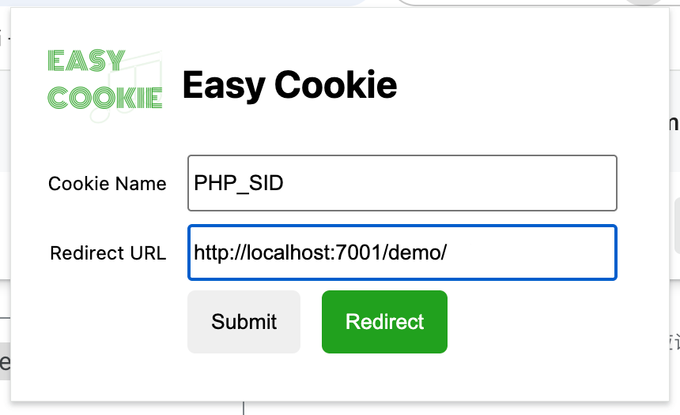

# Easy Cookie

Easy Cookie, a chrome extension help to got cookie from other sites for developers.

In local development, log in to the page of the site of the development environment or test environment. After log in, the cookie is not set to the local domain name. In the normal process, you need to use the developer tool to find the corresponding cookie, and copy it out, and set the cookie through the developer tool when the local domain name is accessed, so that the local website can log in. In general, it takes 1-2 minutes to complete this operation.

Based on 'Easy Cookie', you can configure the name of the cookie you want to fetch, and the url of the local website you want to jump to, and click the 'Submit' button to save. When you visit the development environment or test environment site and log in, you can directly click the "Redirect" button to set the corresponding cookie to the URL to be redirected and skip to it. This operation only needs 2-5 seconds to complete, the operation efficiency is dozens of times higher than the original.

